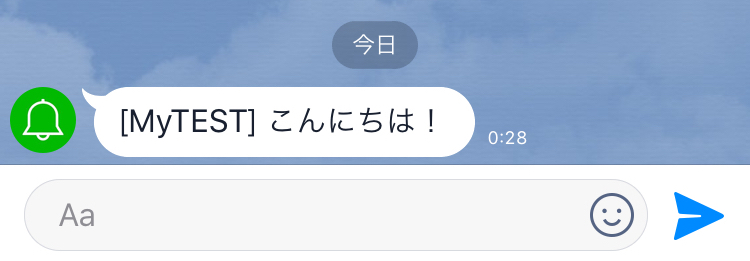

# LINE Notifyをnode.jsで通知

## 事前準備

- LINE Notifyトークン
  - LINEアカウントでマイページへアクセスしトークンを発行する  
  https://notify-bot.line.me/my/
- node.js

## 導入方法

```
$ git clone https://github.com/K1-Style/line-notify-node.git
$ cd line-notify-node
$ npm install
```

## 実行
```
$ LINE_TOKEN=<LINE Notifyトークン>
$ node main.js
notify message : こんにちは！
{ status: 200, message: 'ok' }
```

LINEトークルーム画面での送信結果

